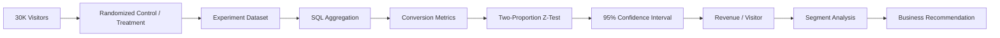

# A/B Test Analysis: Product Pricing Experiment

   

## 📌 Project Overview

A realistic, reproducible **Product Analytics A/B testing project** designed to determine whether reducing a product price from **₹999 to ₹899** improves customer conversion enough to justify the lower price per order.

The project goes beyond calculating a p-value. It combines **Python, SQL, statistical testing, experimentation principles, segmentation and business analysis** to produce a practical product recommendation.

---

## 🎯 Business Problem

The product team is considering a ₹100 price reduction.

The central question is:

> **Will the lower price generate enough additional purchases to improve revenue per visitor?**

A successful experiment should therefore be evaluated on both:

1. **Conversion impact** — Are more visitors purchasing?
2. **Commercial impact** — Does revenue per visitor improve despite the lower price?

---

## 🛠️ Skills & Technologies Used

### Programming & Data Analysis

- **Python** — experiment generation and statistical analysis
- **Pandas** — data manipulation and aggregation
- **NumPy** — reproducible experiment simulation
- **SciPy** — hypothesis testing and probability calculations
- **Matplotlib** — experiment visualizations

### SQL

- SQL aggregation
- `GROUP BY`
- Conversion-rate calculations
- Revenue analysis
- Segmentation queries
- Experiment-balance checks
- Duplicate-user checks

### Statistics & Experimentation

- A/B testing
- Null and alternative hypotheses
- Two-proportion z-test
- p-value
- Statistical significance
- 95% confidence interval
- Absolute conversion lift
- Relative conversion lift
- Practical/business significance

### Product Analytics

- Conversion rate
- Revenue per visitor
- Price elasticity thinking
- Segment analysis
- Experiment decision framework
- Launch / Hold / Iterate recommendations

### Concepts Demonstrated

`A/B Testing` • `Hypothesis Testing` • `Confidence Intervals` • `SQL Analytics` • `Python` • `Product Metrics` • `Segmentation` • `Business Recommendation`

---

## 🧪 Experiment Design

| Component | Design |
|---|---|
| Population | Product-page visitors |
| Sample size | 30,000 visitors |
| Control | ₹999 |
| Treatment | ₹899 |
| Allocation | 50/50 randomized split |
| Primary KPI | Purchase conversion |
| Secondary KPI | Revenue per visitor |
| Statistical test | Two-proportion z-test |
| Confidence level | 95% |
| Significance threshold | α = 0.05 |

The experiment data is generated with a fixed random seed so another analyst can reproduce the exact dataset and results.

---

## 🏗️ Analysis Architecture



---

## 📊 Key Metrics

### Conversion Rate

```text
Conversion Rate = Purchases / Visitors
```

### Absolute Lift

```text
Treatment Conversion − Control Conversion
```

### Relative Lift

```text
(Treatment − Control) / Control
```

### Revenue per Visitor

```text
Total Revenue / Total Visitors
```

These metrics allow the analysis to distinguish between **statistical improvement** and **commercial improvement**.

---

## 🔬 Statistical Framework

### Null Hypothesis — H₀

Control and Treatment have equal conversion rates.

### Alternative Hypothesis — H₁

Control and Treatment have different conversion rates.

### Decision Rule

If:

```text
p-value < 0.05
```

there is statistical evidence that the observed conversion difference is unlikely to be explained by random variation alone.

However, statistical significance by itself does **not** determine the product decision.

---

## 💡 Product Analyst Decision Framework

```text
              Conversion improves?
                       ↓
              Statistically significant?
                       ↓
              Commercially meaningful?
                       ↓
              Revenue / visitor improves?
                       ↓
              Segment performance healthy?
                       ↓
                 LAUNCH / HOLD / ITERATE
```

This is intentionally designed to reflect how a Product Analyst would communicate an experiment to stakeholders.

---

## ▶️ How to Run the Project

### 1. Clone the repository

```bash
git clone https://github.com/sahzad22/ab-test-product-pricing-analysis.git
cd ab-test-product-pricing-analysis
```

### 2. Install dependencies

```bash
pip install -r requirements.txt
```

### 3. Generate the experiment dataset

```bash
python src/generate_experiment.py
```

This creates 30,000 reproducible visitor-level records.

### 4. Run the analysis

```bash
python src/analyze_experiment.py
```

The script calculates the experiment results and generates the analysis outputs.

---

## 📁 Project Structure

```text
ab-test-product-pricing-analysis/
│
├── src/
│   ├── generate_experiment.py
│   └── analyze_experiment.py
│
├── sql/
│   └── experiment_queries.sql
│
├── data/
│   └── pricing_experiment.csv
│
├── analysis/
│   ├── variant_summary.csv
│   ├── segment_results.csv
│   └── conversion_rate.png
│
├── docs/
│   └── BUSINESS_MEMO.md
│
├── requirements.txt
└── README.md
```

---

## 📈 Analysis Outputs

The project generates:

- Variant-level visitor counts
- Conversion counts
- Conversion rate
- Absolute conversion lift
- Relative conversion lift
- z-statistic
- p-value
- 95% confidence interval
- Revenue per visitor
- Device-level conversion results
- Conversion-rate visualization

---

## 💼 Business Recommendation

The final recommendation is generated from the actual experiment output rather than being manually written into the analysis.

Possible outcomes are:

### 🟢 LAUNCH

Treatment is statistically significant and improves revenue per visitor.

### 🟡 HOLD

Treatment improves conversion but does not improve the commercial outcome.

### 🔵 ITERATE / RUN AGAIN

Evidence is insufficient to confidently change the product price.

---

## 📄 Stakeholder Memo

The repository includes `docs/BUSINESS_MEMO.md`, which translates the statistical results into language suitable for Product, Growth and Commercial stakeholders.

The memo focuses on:

- What changed
- Whether the result is statistically reliable
- Whether the result matters commercially
- Risks
- Recommended next steps

---

## 🔮 Production Extensions

A real production experiment could be extended with:

- Power analysis before experiment launch
- Sample-size calculation
- Minimum Detectable Effect (MDE)
- Experiment exposure logging
- Pre-registration of hypotheses
- Guardrail metrics
- Refund/cancellation analysis
- Customer lifetime value impact
- Longer-term retention analysis
- Multiple-testing corrections for many variants

---

## 📌 Resume Project Description

> **A/B Test Analysis: Product Pricing Experiment — Python, SQL, Statistical Testing**  
> Designed and analyzed a simulated pricing A/B test using Python and SQL; applied hypothesis testing and confidence intervals to quantify conversion lift and revenue impact, then translated statistical results into a product launch recommendation.

---

## 👤 Portfolio

**GitHub:** https://github.com/sahzad22
