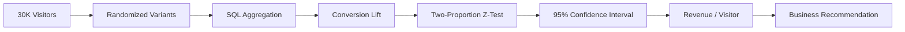

# A/B Test Analysis: Product Pricing Experiment

   

> **Python • SQL • Statistics • Product Analytics**

## Executive Summary

This project evaluates a simulated pricing experiment designed to answer a real product question:

> **Does a lower product price improve conversion enough to justify the reduction in revenue per order?**

Users are randomly assigned to **Control (₹999)** or **Treatment (₹899)**. The analysis covers experiment design, SQL aggregation, conversion rate, hypothesis testing, 95% confidence intervals, revenue per visitor, segmentation, and a business recommendation.

## Experiment at a Glance

| Metric | Control | Treatment |
|---|---:|---:|
| Price | ₹999 | ₹899 |
| Allocation | 50% | 50% |
| Primary KPI | Conversion | Conversion |
| Secondary KPI | Revenue / Visitor | Revenue / Visitor |

## Analysis Flow



## Run It

```bash
pip install -r requirements.txt
python src/generate_experiment.py
python src/analyze_experiment.py
```

The generator creates **30,000 reproducible visitor records**. The analysis produces variant-level results, confidence intervals, p-value, revenue per visitor and device-level results.

## Statistical Framework

**Null hypothesis (H₀):** Control and Treatment have equal conversion rates.

**Alternative hypothesis (H₁):** Conversion rates differ.

Decision threshold: **α = 0.05**.

The analysis reports:

- Absolute conversion lift
- Relative conversion lift
- z-statistic
- p-value
- 95% confidence interval
- Revenue per visitor
- Segment-level conversion

## Product Analyst Thinking

A statistically significant conversion lift is **not automatically a launch decision**. The analysis also evaluates whether the price reduction improves revenue per visitor and whether the effect is consistent across segments.

### Decision logic

```text
Statistically significant?
        ↓
Commercially meaningful?
        ↓
Revenue / visitor improved?
        ↓
No major segment regression?
        ↓
        LAUNCH / HOLD / ITERATE
```

## Repository Contents

- `src/generate_experiment.py` — reproducible experiment generator
- `src/analyze_experiment.py` — statistical and business analysis
- `sql/experiment_queries.sql` — reusable SQL analysis
- `analysis/variant_summary.csv` — generated experiment summary
- `analysis/segment_results.csv` — device-level analysis
- `analysis/conversion_rate.png` — visual result
- `docs/BUSINESS_MEMO.md` — decision-oriented recommendation framework

## Business Recommendation

The final recommendation is generated from the actual experiment results rather than hard-coded narrative. This makes the project demonstrably reproducible during a recruiter or interviewer walkthrough.

## Resume-ready statement

> Designed and analyzed a simulated product-pricing A/B test using Python and SQL; applied hypothesis testing and confidence intervals to quantify conversion lift and revenue impact, then translated statistical results into a product launch recommendation.
